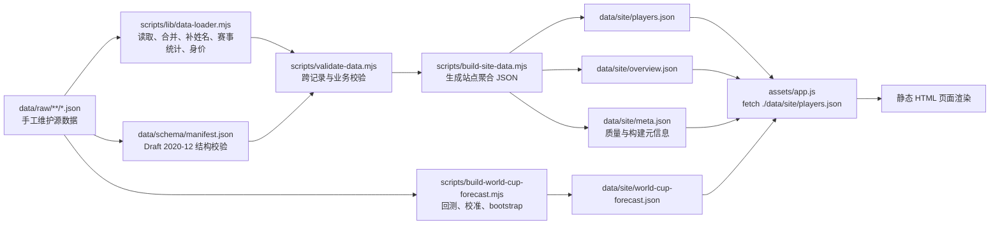

# 数据流与生成产物

更新时间：2026-07-11

本文解释项目从手工维护的 raw JSON 到站点 JSON、SQLite、本地预览和 GitHub Pages 的数据流。字段细节见 `docs/validation.md`、`docs/sqlite.md` 和 `docs/api.md`。

## JSON 数据流



本地一键命令：

```bash
npm run prepare-data
```

等价于依次执行：

```bash
npm run validate-data
npm run build-data
npm run sync-sqlite
```

`prepare-data` 会先校验，再生成 `data/site/**`，最后生成本地 SQLite。

## GitHub Pages 数据流

```mermaid
flowchart LR
  Push["push main"] --> Action[".github/workflows/deploy-pages.yml"]
  Action --> Setup["actions/setup-node@v4<br/>node-version: 25"]
  Setup --> Prepare["node scripts/prepare-data.mjs"]
  Prepare --> Check["npm run check-generated<br/>临时目录逐字节比较"]
  Check --> Dist["dist/<br/>HTML + assets + data"]
  Dist --> Stamp["stamp-site-meta.mjs<br/>只在 dist 注入 commit 与构建时间"]
  Stamp --> Upload["actions/upload-pages-artifact"]
  Upload --> Deploy["actions/deploy-pages"]
```



Pages 构建会重新运行 `prepare-data`，然后把以下内容复制到 `dist/`：

- 根目录下的 `*.html`
- `assets/**`
- `data/**`

`storage/**` 不会被复制到 Pages artifact。

## raw、site、storage 的边界

| 路径 | 角色 | 是否手工维护 | 是否提交 | 是否发布到 Pages | 是否需要 review |
| --- | --- | --- | --- | --- | --- |
| `data/raw/**` | 源数据 | 是 | 是 | 是，作为 `data/raw/**` 一起被复制 | 是，重点 review |
| `data/site/players.json` | 前端球员聚合 JSON | 否，由脚本生成 | 是 | 是，页面直接 fetch | 是，确认生成结果和 diff |
| `data/site/overview.json` | 前端总览聚合 JSON | 否，由脚本生成 | 是 | 是，页面直接 fetch | 是，确认统计和聚合 |
| `data/site/meta.json` | 构建、覆盖与质量元信息 | 否，由脚本生成 | 是 | 是，数据中心直接 fetch | 是，确认状态与统计口径 |
| `data/site/world-cup-forecast.json` | 2030—2042 世界杯预测、回测与区间 | 否，由预测脚本生成 | 是 | 是，预测页直接 fetch | 是，确认模型假设、名额校准和生成结果 |
| `data/schema/**` | Draft 2020-12 Schema 与 manifest | 是 | 是 | 是 | 是，字段结构变更时同步 review |
| `storage/youth-football.sqlite` | 本地 SQLite 查询库 | 否，由脚本生成 | 否，`.gitignore` 已排除 | 否 | 不 review 文件本身 |
| `dist/**` | Pages 构建 artifact | 否，由 CI 生成 | 否 | 是，作为部署 artifact | 不在 PR 中 review |
| `outputs/**` | 本地图片/报告等产物 | 否，按具体任务生成 | 默认不提交 | 否，除非另有页面集成 | 只在对应任务 review |

`data/site/**` 虽然是生成文件，但当前仍提交到仓库，原因是：

- 方便不运行 Node 的读者直接查看静态 JSON。
- 让 PR review 能看到 raw 修改对站点聚合结果的影响。
- GitHub Pages 构建时会重新生成，避免部署使用过期聚合。

loader 也承担少量集中数据的派生合并。例如中国 U20 2025、中国 U23 2026 的逐人赛事统计集中维护在 `tournament-archive.json`，再按 `competition_id + player_id` 合并到球员的 `tournament_participation`。这样逐场阵容和事件只需维护一套统计和来源，生成后的 `data/site/players.json` 仍提供完整 appearances、starts、substitute appearances、goals、minutes、cards 和 roster status。

如果只改文档，不需要重新生成 `data/site/**`。如果改了 `data/raw/**`、`scripts/lib/data-loader.mjs` 或 `scripts/build-site-data.mjs`，应运行 `npm run build-data` 并 review `data/site/**` diff。

## `generated_at` 日期

`data/site/overview.json` 的 `generated_at` 由 `scripts/build-site-data.mjs` 中的 `generatedAt` 常量决定，目前不是运行时自动取当前日期。

维护规则：

- 当 raw 数据、数据口径或聚合逻辑发生需要对外标记的更新时，同步更新 `generatedAt`。
- 只改文档、样式或非数据展示逻辑时，不需要更新 `generatedAt`。
- `assets/app.js` 会使用 `overview.generated_at` 展示“聚合生成”日期，并用它计算年龄、当前年份和未来比赛状态。

后续可做：把 `generatedAt` 改成可配置输入，例如 `SITE_GENERATED_AT=YYYY-MM-DD npm run build-data`，并在缺省时保持显式失败，避免 CI 随运行日期产生无意义 diff。

## 页面 fetch 行为

一般页面由 `assets/app.js` 并行请求 `players.json` 和 `overview.json`；数据中心不需要球员明细，只独立请求：

- `./data/site/overview.json`
- `./data/site/meta.json`

数据中心对两个请求分别降级：meta 失败只影响覆盖质量视图，overview 失败时国家对比、项目和教练视图各自显示加载失败状态。

预测页另外请求：

- `./data/site/world-cup-forecast.json`（只有 `predictions.html` 请求，不增加其他页面的网络请求）

请求会追加 `_v=<SITE_DATA_VERSION>`，其中 `SITE_DATA_VERSION` 跟随脚本 URL 上的版本参数或页面日期；同时 `fetch` 使用 `cache: "no-store"`。这用于减少浏览器缓存旧 JSON 的概率，不等于 API 版本承诺。

## 生成文件 review 规则

PR review 时按以下顺序看：

1. 先看 `data/raw/**` 或脚本变更，确认源数据和逻辑是否合理。
2. 再看 `data/site/**`，确认聚合结果符合预期。
3. SQLite 只通过运行命令验证，不 review 二进制文件。
4. `dist/**`、`storage/**`、`outputs/**`、临时报告和截图产物不要混入普通数据 PR。

`npm run check-generated` 会在临时目录重新生成全部受管 `data/site` 文件并逐字节比较，不会先覆盖工作区，因此适合本地检查和 CI。仓库提交的 `meta.json` 始终是可复现的未盖章版本；部署工作流只修改 `dist/data/site/meta.json`。

## 后续可做

- 让 Pages artifact 只发布必要的 `data/site/**`，避免发布 `data/raw/**`，前提是先确认外部读者不依赖 raw JSON。
