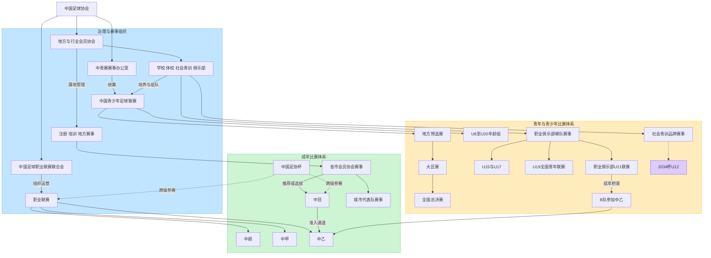
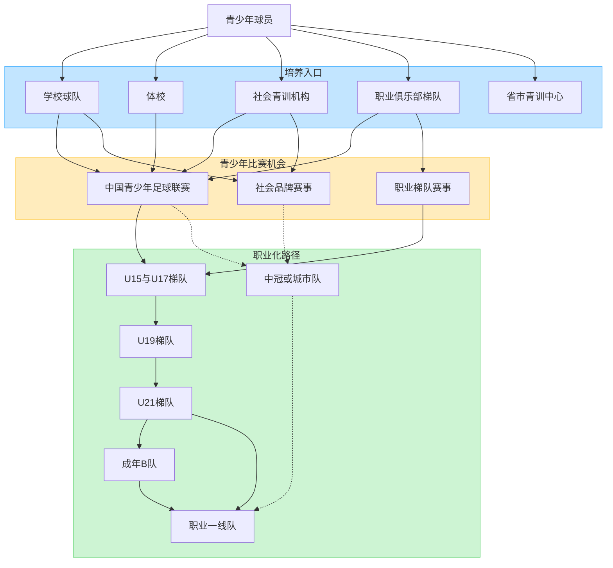
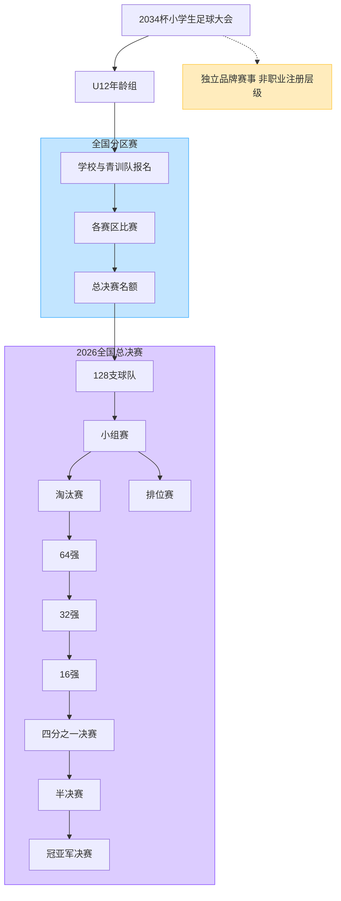

# 中国足球治理、球员培养、比赛体系与 2034 杯树状图

更新时间：2026-08-02

本说明把容易混写的四个层次拆开：足协治理体系、成年比赛体系、职业球员培养路径、青年与青少年比赛体系。文中的“2034 杯”指 2021 年创办的 U12 小学生足球大会，不是 2034 年 FIFA 世界杯。

## 总体树状图

阅读边界：

- 中足联在中国足协授权下组织运营各级职业联赛；图中的中超、中甲、中乙是成年职业联赛主干。
- 地方会员协会承担属地注册、培训和地方竞赛。地方城市联赛可能形成中冠推荐或选拔入口，但不是自动、固定的职业第五级。
- 足协杯是跨层级杯赛，不表示参赛队因此改变联赛等级。
- 中青赛是学校、体校、社会青训机构和俱乐部梯队开放参加的统一平台；2026 男子组设置小学 U8—U12、初中 U13/U15、高中 U17和大学 U20。
- 2034 杯属于独立社会青训品牌赛事。参赛、借调、获奖或被观察，均不能直接证明职业俱乐部注册。

## 职业球员培养与比赛出口

这是一组可能路径，不是自动晋级流程。球员可能跨学校、省队、社会机构和俱乐部训练，也可能不经过 U21 或 B 队直接进入一线队；中冠、城市队和杯赛节点只证明比赛经历，不覆盖当前注册单位。

## 2034 杯 U12 赛制树状图

以下采用第六届 2026 赛制快照。官方公开页面确认赛事为 U12、分区赛后进入全国总决赛，总决赛 128 队、约 2600 人、9 人制，包含小组赛、淘汰赛和 8 月 1 日冠亚军决赛；448 场为冠名方发布的整届总决赛场次口径。完整分组排序、晋级和排位细则仍应以该届竞赛规程为准。

## 口径对照

| 名称 | 主要参赛主体 | 赛事性质 | 是否直接证明职业注册 |
| --- | --- | --- | --- |
| 中超 / 中甲 / 中乙 | 准入职业俱乐部一线队；中乙另有符合规则的 B 队 | 成年职业联赛 | 是，但仍需核对具体赛季注册名单 |
| 中冠 | 地方推荐或大区赛晋级的俱乐部主体 | 成年全国业余/半职业准入通道 | 否 |
| 中国青少年足球联赛 | 学校、体校、社会青训、俱乐部梯队 | 全国开放青少年赛事 | 否 |
| 职业俱乐部 U15/U17/U19/U21 | 职业俱乐部年龄段梯队及规程允许主体 | 俱乐部青年比赛体系 | 证明梯队参赛，不等于一线队注册 |
| 2034 杯 U12 | 小学、基层和社会青训队伍等 | 独立社会品牌青少年赛事 | 否 |

## 主要来源

- [中国足球协会会员单位](https://www.thecfa.cn/huiyuandanwei/index.html)
- [中国足球职业联赛联合会](https://www.cfl-china.cn/zh/index.html)
- [中国青少年足球联赛赛事组织工作方案](https://www.thecfa.cn/qsn/20250418/35874.html)
- [2026 第五届中国青少年足球联赛赛事组织方案](https://imageoss.thecfa.cn/upload/file/20260227/1772174197388827.pdf)
- [中国青少年足球改革发展实施意见](https://www.thecfa.cn/qsn/20240328/33951.html)
- [第六届 2034 杯总决赛开赛信息](https://www.sipac.gov.cn/szgyyq/tsyq/202607/a7bbe44a54a94775a24b988f82333bae.shtml)
- [第六届 2034 杯 128 队与总决赛规模](https://www.sipac.gov.cn/szgyyq/jsdt/202607/ba5526eed1b8418cb97ccaf05d412c47.shtml)
- [第六届总决赛 448 场口径](https://www.sungent.com/index.php?article=5414&id=25&m=article)
